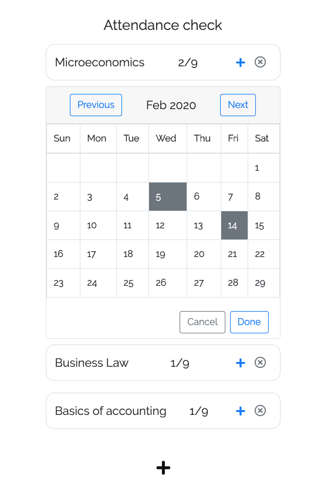

# Attendance Track
Attendance track is a project used to track the attendance at lectures. 

# Installation
The project is created as a simple web site run on localhost.
All the needed data is added to local storage of the browser with the key 'selected_days_key'.

